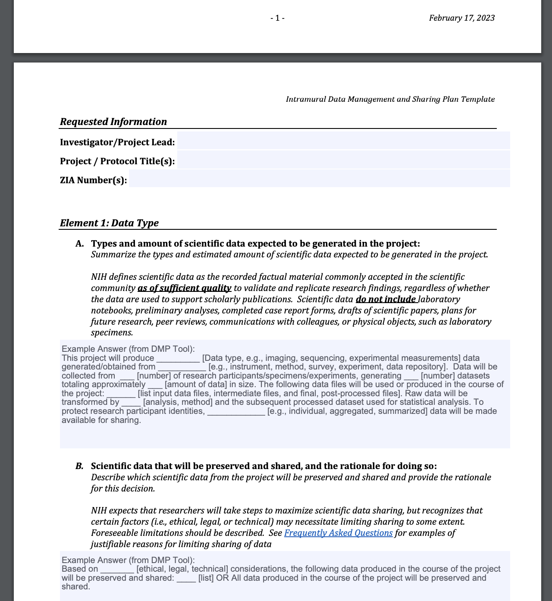

```{r xaringan-themer, include=FALSE, warning=FALSE}
library(xaringanthemer)
# the two PCCTC colors are #0085ca and #62b5e5
# complement of #62b5e5 is #e59262
# #d362e5 is a tertiary
style_duo_accent(
  primary_color = "#62b5e5",
  secondary_color = "#e59262",
  colors = list(
    blue = "#62b5e5",
    orange = "#e59262",
    white = "#ffffff",
    purple = "#d362e5",
    darkblue = "#0085ca"
  ),
  extra_fonts = list(google_font("Raleway"))
)
```

class: title-slide-custom

## Common Data Models +<br>Data Management Plans

### Travis Gerke, ScD

<!--
Photo by <a href="https://unsplash.com/@nananadolgo?utm_source=unsplash&utm_medium=referral&utm_content=creditCopyText">Nana Smirnova</a> on <a href="https://unsplash.com/s/photos/data?utm_source=unsplash&utm_medium=referral&utm_content=creditCopyText">Unsplash</a>
-->

---

.pull-left[


]

.pull-right[


]

---
class: center, middle
background-image: url(images/asset.png)
background-size: contain

---
class: blue-bg, center, middle

## .white[Whose asset is it?]

--
### .darkblue[Co-creation implies collective ownership: participants, funders/sponsors, researchers]

[.white[Ballantyne (2020) Journal of Medical Ethics]](https://jme.bmj.com/content/46/5/289)

---
## Participants are the key stakeholders

What's important to them?

--

- Want to get better (72%)
- Help other people (45%)
  - [Williams et al. (2021) JAMA Netw. Open](https://jamanetwork.com/journals/jamanetworkopen/fullarticle/2784556)

--

-----

#### Data sharing is the greatest accelerator towards both goals

- Effective treatments are identified only when power is sufficient (i.e. enough data is seen in multifaceted clinical settings)
- Crowdsourcing research questions and analysis increase speed and quality
- Participants are supportive and often expect that data are being shared to maximize benefit to others
  - 93% want their data shared across universities, 82% want it shared with for-profit companies
  - [Mello et al. (2018) NEJM](https://www.nejm.org/doi/10.1056/NEJMsa1713258)

---
## The data sharing accelerator

- Not incentivized by traditional institutions and funding models
  - i.e. keep your data, get more publications, recycle for more grants

--

<br>
.center[

]

---
class: blue-bg, center, middle

## .white[Why are we here?]

---
## Why we are *not* here

--

- To make money

--

## Why we are here

- Help participants get better
- Help other people

--

-----

#### You are the institutions of the future

--

- YOLO
--

- Put your best ideas in all at once, share everything (**ethically**)
- If your future is scooped by sharing see .orange[\#altac] 
  - (I do **not** think this will happen)
- Good people at NIH (c.f. [Dr. Kraft](https://dceg.cancer.gov/about/staff-directory/kraft-peter)) are promoting better practice / tools
  - (i.e. you will have friends in this journey)

---
## Data management and sharing plans

--
**.orange[Tired]**

--
* "_All_ data will be secured and password protected on an internal machine. Only the PI and research staff will have access. Data will be destroyed at study conclusion."

--
* "Data available upon request"

--
  
.center[
<a href="https://www.sciencedirect.com/science/article/abs/pii/S089543562200141X"></a>
]

---
## Data management and sharing plans

**.orange[Wired]**
* The NIH [template](https://oir.nih.gov/system/files/media/file/2023-02/template-data_management_plan.pdf)

.center[
<a href="https://oir.nih.gov/system/files/media/file/2023-02/template-data_management_plan.pdf"></a>
]

---
## Things that used to be hard

**.orange[A recipe for optimal sharing]**

1. Pick a good sharing framework to follow (e.g. FAIR)

2. Know your PHI, plan for de-identification 

3. Follow a common data model whenever possible

4. Write good documentation, share your analytic code (e.g. GitHub)

5. Choose a storage repository
  - Also: create a DOI for your data (e.g. [OSF.io](https://help.osf.io/article/220-create-dois))

6. Encouraged bonus: modify your code in 4. to pull the data from 5.

---
## Frameworks for sharing

[**.orange[FAIR]**](https://www.go-fair.org/fair-principles/)
1. Findable
  - All data is findable through a persistent identifier and have thorough, searchable metadata
2. Accessible
  - Users can access your data
3. Interoperable
  - Data and metadata use standardized vocabularies and formats (i.e. both humans and machines can read and formats are software agnostic)
4. Reusable
  - Metadata richly describes context under which data was created so users can decide if the data will be _useful_

[OSF](https://osf.io/) (Open Science Framework)

[SEER](https://ies.ed.gov/seer/index.asp) (Standards for Excellence in Education Research)

** Make sure to check your framework against consent and protocol

---
## De-identification $\ne$ anonymization

* De-identification: removal of attributes known to increase the risk of identification (e.g. the [19 PHI elements](https://privacyruleandresearch.nih.gov/pr_08.asp))

  * Dates of service often the most difficult to handle: retain analytic viability by converting to time since enrollment, assign each patient random shift between 1-365, fancier methods (e.g. [shift and truncate](https://www.ncbi.nlm.nih.gov/pmc/articles/PMC5070517/))

* Anonymization: irreversible removal of links between the individual and PHI to the degree that it would be virtually impossible to reestablish the link
  * De-identification is a precursor step
  
* In general, de-identification is all that is required to publicly share and to qualify subsequent uses of the data as not human subjects research

---
## Common data models

* Primary benefits: consistent naming allows same analytic scripts to be run across all aligned data sets, metadata and dictionaries are predefined, naming conventions are given to you

-----

* [OMOP](https://www.ohdsi.org/data-standardization/) (Observational Medical Outcomes Partnership)
  * Best for EHR/claims data

* [CDISC](https://www.cdisc.org/standards) (Clinical Data Interchange Standards Consortium)
  * The regulatory requirement for clinical trials data, e.g. SDTM/ADaM

* [NIH CDE](https://cde.nlm.nih.gov/home) (Common Data Elements repository)
  * Developing, keep your eye on this one!

---
## Documentation and metadata

* [How to Share Data for Collaboration](https://www.ncbi.nlm.nih.gov/pmc/articles/PMC7518408/pdf/nihms-1502431.pdf) (Ellis & Leek, 2018)


---
## Storage

* [NCI Cancer Data Service](https://datacommons.cancer.gov/repository/cancer-data-service)
  * Includes [dbGaP](https://www.ncbi.nlm.nih.gov/gap/)
  
* [Gene expression omnibus](https://www.ncbi.nlm.nih.gov/geo/)

* [Generalist repositories](https://sharing.nih.gov/data-management-and-sharing-policy/sharing-scientific-data/generalist-repositories) (good for non-genetic data or small biomarker sets)

  * [Figshare](https://figshare.com/); [OSF](https://osf.io/); [Synapse](https://www.synapse.org/); [GitHub](https://github.com/)
  
-----

* [A huge list of other options from NIH](https://sharing.nih.gov/data-management-and-sharing-policy/sharing-scientific-data/repositories-for-sharing-scientific-data)
  

---
## Resources

* [NIH Scientific Data Sharing](https://sharing.nih.gov/)

* [Data Management in Large-Scale Education Research (free e-book)](https://datamgmtinedresearch.com/index.html)

* [Data Sharing and Organization](https://tgerke.github.io/data-sharing-and-organization/)

* [GO FAIR](https://www.go-fair.org/)

* [Trans-Divisional Research Program](https://dceg.cancer.gov/about/organization/tdrp)

<!-- tip for title css from
https://stackoverflow.com/questions/64269808/is-it-possible-to-adjust-background-image-opacity-in-a-xaringan-slideshow
-->

```{css, echo = FALSE}
.title-slide-custom {
  position: relative;
  z-index: 1;
}
.title-slide-custom h2 {
  font-size: 1.3em;
  position: absolute;
  bottom: 3%;
  left: 2%;
}
.title-slide-custom h3 {
  font-size: .75em;
  color: var(--orange);
  position: absolute;
  bottom: 0%;
  left: 2%;
}
.title-slide-custom::before {    
      content: "";
      background-image: url('images/nana-smirnova-IEiAmhXehwE-unsplash.jpg');
      background-size: cover;
      position: absolute;
      top: 0px;
      right: 0px;
      bottom: 0px;
      left: 0px;
      opacity: 0.7;
      z-index: -1;
}
.title-slide-custom .remark-slide-number {
  display: none;
}
.blue-bg {
  background-color: var(--blue);
}
.h-center {
  margin: 0 auto;
}
.w-90 {
  width: 90%;
}
.w-50 {
  width: 50%;
}
.small-rule{
  font-size: 1em;
  font-weight: bold;
  color: var(--darkblue);
}

.highlight-last-item > ul > li, 
.highlight-last-item > ol > li {
  opacity: 0.5;
  color: var(--orange);
}
.highlight-last-item > ul > li:last-of-type,
.highlight-last-item > ol > li:last-of-type {
  opacity: 1;
  font-weight: bold;
}
```
